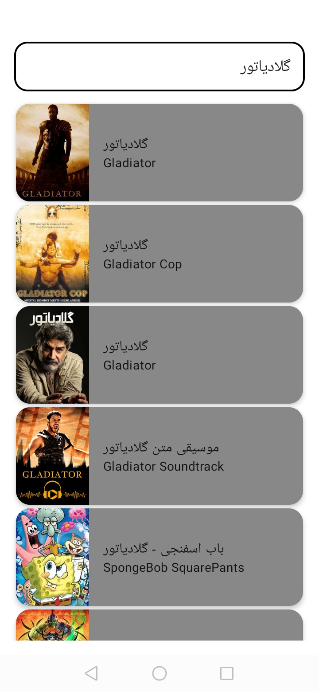
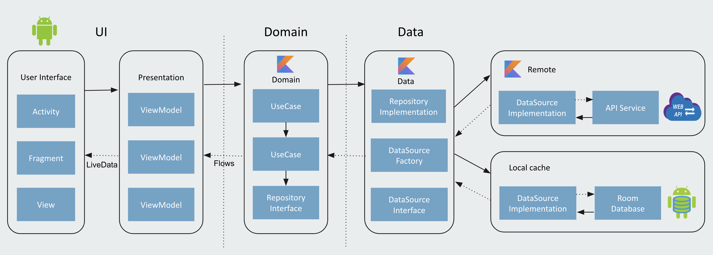

# MovieMo
The MovieMo - App consuming a [Movie API](https://www.filimo.com/api/en/v1/movie/movie/list/tagid/1000300/text/{Query}/sug/on) to display Movies it has been built with clean architecture principles, Repository Pattern, and MVVM pattern as well as Architecture Components.

This app shows the usage of the new Navigation Compose.

**App features:**
- Movie List Screen


## Screenshots
 

## Architecture
Uses concepts of the notorious Uncle Bob's architecture called [Clean Architecture](https://blog.cleancoder.com/uncle-bob/2012/08/13/the-clean-architecture.html).</br>

* Better separation of concerns. Each module has a clear API., Feature related classes life in different modules and can't be referenced without explicit module dependency.
* Features can be developed in parallel eg. by different teams
* Each feature can be developed in isolation, independently from other features
* faster compile time


## Modules:
* **MovieMo-ui** - It uses all the components and classes related to Android Framework. It gets the data from presentation layer and shows on UI. (**access all the modules**)
* **data** - The data layer implements the repository interface that the domain layer defines. This layer provide a single source of truth for data. (Kotlin module that **can only access domain module**)
* **remote** - Handles data interacting with the network. (**can only access data module**)
* **cache** - Handles data interacting with the local storing (Room DB). (**can only access data module**)
* **domain** - The domain layer contains the UseCases that encapsulate a single and very specific task that can be performed. This task is part of the business logic of the application. (Kotlin module that **cannot access any other module**)
* **presentation** - MVVM with ViewModels exposing LiveData that the UI consume. The ViewModel does not know anything about it's consumers. (Android module that **can only access domain module**)

## Tech stack - Library:

- [Kotlin](https://kotlinlang.org/)
- [Jetpack-Compose](https://developer.android.com/jetpack/compose) -  Used for building native UI
- [Coroutines](https://github.com/Kotlin/kotlinx.coroutines) - A coroutine is a concurrency design pattern that you can use on Android to simplify code that executes asynchronously
- [Flow](https://kotlin.github.io/kotlinx.coroutines/kotlinx-coroutines-core/kotlinx.coroutines.flow/) - Flow is used to pass (send) a stream of data that can be computed asynchronously
- [Dagger-Hilt](https://developer.android.com/training/dependency-injection/hilt-android) - for dependency injection.
- [Kotlin-DSL](https://docs.gradle.org/current/userguide/kotlin_dsl.html) - Used to handle gradle dependencies and config versions
- JetPack
  - [LiveData](https://developer.android.com/topic/libraries/architecture/livedata) - For reactive style programming (from VM to UI).
  - [Lifecycle](https://developer.android.com/jetpack/androidx/releases/lifecycle) - Used get lifecyle event of an activity or fragment and performs some action in response to change
  - [ViewModel](https://developer.android.com/topic/libraries/architecture/viewmodel) - Stores UI-related data that isn't destroyed on UI changes.
  - [Room](https://developer.android.com/topic/libraries/architecture/room) - Used to create room db and store the data.
  - [Navigating with Compose](https://developer.android.com/jetpack/compose/navigation) - Used to navigate between screens
- [Material-Components](https://github.com/material-components/material-components-android) - Material design components like ripple animation, cardView.
- [Retrofit](https://github.com/square/retrofit) - Used for REST api communication.
- [OkHttp](http://square.github.io/okhttp/) - HTTP client that's efficient by default: HTTP/2 support allows all requests to the same host to share a socket
- [Moshi](https://github.com/square/moshi) - Used to convert Java Objects into their JSON representation and vice versa.
- [Timber](https://github.com/JakeWharton/timber) - Used for logging.
- [Coil](https://bumptech.github.io/glide/) - Landscapist is a Jetpack Compose image loading solution that fetches and displays network images with Glide, Coil, and Fresco

## Reference repository
This repository code is mostly inspired by [Android-Clean-Architecture-Boilerplate](https://github.com/bufferapp/android-clean-architecture-boilerplate).

## License & Copyright
```
Copyright 2022 Maede Khoshkam.

Licensed under the Apache License, Version 2.0 (the "License");
you may not use this file except in compliance with the License.
You may obtain a copy of the License at

   http://www.apache.org/licenses/LICENSE-2.0

Unless required by applicable law or agreed to in writing, software
distributed under the License is distributed on an "AS IS" BASIS,
WITHOUT WARRANTIES OR CONDITIONS OF ANY KIND, either express or implied.
See the License for the specific language governing permissions and
limitations under the License.
```
